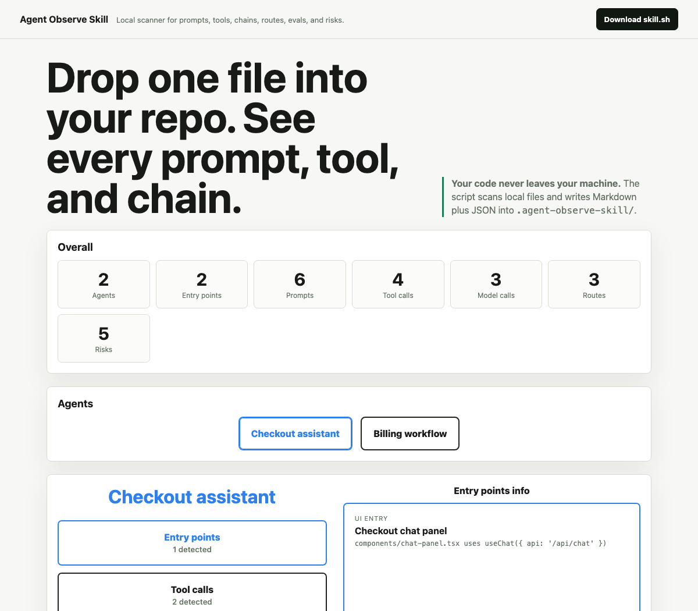

# Agent Observe Skill

Agent Observe Skill is a local scanner for AI-agent codebases. It looks for Vercel AI SDK patterns first, then writes an observability report into the repo it scans. Your code never leaves your machine.

## UI Example



## Use With Codex

### Install Globally In Codex

Add this repository's plugin marketplace to your personal Codex app:

```bash
codex plugin marketplace add scottschindler/agent-observe-skill --sparse .agents/plugins
```

Then restart Codex, open the Plugin Directory, choose the **Agent Observe** marketplace, and install **Agent Observe Skill**.

After installing the plugin, invoke:

```text
Use $agent-observe-skill to scan this repo for prompts, tools, model calls, entry points, routes, eval gaps, and trace risks.
```

To refresh the marketplace later:

```bash
codex plugin marketplace upgrade agent-observe-marketplace
```

### Install From A Repo Marketplace

If a repository already contains `.agents/plugins/marketplace.json`, open that repo in Codex, restart Codex, open the Plugin Directory, choose the repo marketplace, and install the plugin listed there.

### Install As A Repo Skill

For Codex, the simplest repo-scoped install is to put the skill folder in the target repo at:

```text
.agents/skills/agent-observe-skill/
```

Codex scans `.agents/skills` from your working directory up to the repo root. After the folder is present, Codex can invoke the skill explicitly with `$agent-observe-skill`.

#### Add To A Codex Repo

From the root of the repo you want to scan, run:

```bash
tmpdir=$(mktemp -d)
git clone --depth 1 https://github.com/scottschindler/agent-observe-skill.git "$tmpdir/agent-observe-skill"
mkdir -p .agents/skills
rm -rf .agents/skills/agent-observe-skill
cp -R "$tmpdir/agent-observe-skill/agent-observe-skill" .agents/skills/agent-observe-skill
rm -rf "$tmpdir"
```

Commit the skill with your repo if you want everyone on the project to have it:

```bash
git add .agents/skills/agent-observe-skill
git commit -m "Add agent observe Codex skill"
```

Then start or restart Codex from that repo and ask:

```text
Use $agent-observe-skill to scan this repo for prompts, tools, chains, routes, eval gaps, and trace risks.
```

Codex should generate and summarize:

```text
.agent-observe-skill/index.html
.agent-observe-skill/report.md
.agent-observe-skill/trace-map.json
```

In a Next.js App Router repo, the scanner also creates:

```text
app/agent-observe-skill/page.tsx
```

After the dev server reloads, open:

```text
/agent-observe-skill
```

The generated UI is intentionally simple: overall counts, agent buttons, evidence buttons, and one detail panel. Users can select an agent, then inspect entry points, tool calls, prompts, model calls, routes, and risks locally in the browser.

The generated report files are local-only by default. The scanner adds these paths to the target repo's `.git/info/exclude`, not `.gitignore`, so they do not show up in normal `git status` output and are not committed by `git add .`:

```text
.agent-observe-skill/
app/agent-observe-skill/
```

Only force-adding them with `git add -f` will include them in a commit.

#### Use It In This Repo

This repository already includes the repo-scoped Codex path:

```text
.agents/skills/agent-observe-skill -> ../../agent-observe-skill
```

That symlink is only for developing this skill in this repository. Target repos should copy the actual skill folder into `.agents/skills/agent-observe-skill/`.

#### Optional: Install As A Personal Codex Skill

If you want the skill available in every Codex repo on your machine, copy it to your user skills folder instead:

```bash
tmpdir=$(mktemp -d)
git clone --depth 1 https://github.com/scottschindler/agent-observe-skill.git "$tmpdir/agent-observe-skill"
mkdir -p "$HOME/.agents/skills"
rm -rf "$HOME/.agents/skills/agent-observe-skill"
cp -R "$tmpdir/agent-observe-skill/agent-observe-skill" "$HOME/.agents/skills/agent-observe-skill"
rm -rf "$tmpdir"
```

Restart Codex if it does not appear immediately, then ask:

```text
Use $agent-observe-skill to scan this repo for prompts, tools, chains, routes, eval gaps, and trace risks.
```

## Install With skills.sh For Claude Code

For Claude Code, install the skill with the skills.sh CLI:

```bash
npx skills add scottschindler/agent-observe-skill
```

Then invoke it from Claude Code:

```text
Use $agent-observe-skill to scan this repo for prompts, tools, chains, routes, eval gaps, and trace risks.
```

## What It Generates

The scanner creates a local output folder in the target repo:

```text
.agent-observe-skill/
├── index.html
├── report.md
├── prompts.md
├── tools.md
├── chains.md
├── routes.md
├── risks.md
└── trace-map.json
```

Start with `index.html` for the visual report or `report.md` for the Markdown summary. The visual report includes overall counts, agent selection, and per-agent detail views for entry points, tool calls, prompts, model calls, routes, and risks. Use `trace-map.json` for structured follow-up analysis or visualizations. These generated files are added to `.git/info/exclude` so they stay out of ordinary commits.

## What It Detects

The scanner prioritizes Vercel AI SDK and agent patterns:

- `streamText(...)`
- `generateText(...)`
- `streamObject(...)`
- `generateObject(...)`
- `tool(...)`
- `ToolLoopAgent`
- `system`, `prompt`, and `messages`
- `inputSchema`
- `execute`
- API routes under `app/api/**` and `pages/api/**`
- Client chat hooks like `useChat(...)`, `useCompletion(...)`, and `useAssistant(...)`

It also flags common observability risks:

- Inline prompts that are hard to audit
- Side-effecting tools
- Chains without nearby eval evidence
- Chains without trace IDs, logging, or telemetry evidence
- AI routes without trace coverage

## Report Questions

The generated report answers:

- Where are prompts defined?
- Which model calls use which prompts?
- Which tools can each chain call?
- What schemas do tools expose?
- Which tools have side effects?
- Which routes expose AI behavior?
- Which chains lack evals?
- Which chains lack trace IDs or logging?
- Which prompts are inline and hard to audit?

## How It Works

`scripts/skill.sh` is portable Bash. When Node is available, it runs an embedded Node scanner for richer static analysis and JSON output. When Node is not available, it falls back to Bash and grep-based detection while still producing the same output files.

The scanner ignores common generated or dependency folders such as `.git`, `node_modules`, `.next`, `dist`, `build`, `coverage`, and `.agent-observe-skill`.

## Privacy

The scanner reads local files and writes local Markdown and JSON. It does not upload source code, call a remote API, or require credentials.

## Demo Page

The static product demo is available at:

```text
/agent-observe-skill/
```

Its source is `agent-observe-skill/index.html`. It includes:

- A download button for `skill.sh`
- Overall counts
- Agent selection
- Per-agent detail buttons for entry points, tool calls, prompts, model calls, routes, and risks
- A focused detail panel

To preview it locally, serve the repo with any static file server and open `/agent-observe-skill/`.
