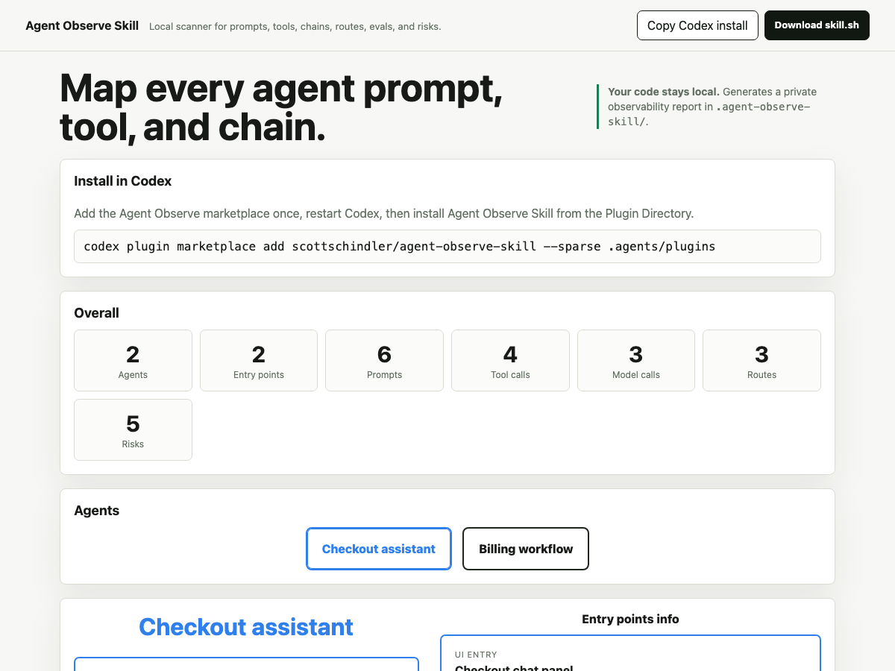

# Agent Observe Skill

Agent Observe Skill is a local scanner for AI-agent codebases. It looks for Vercel AI SDK patterns first, then writes an observability report into the repo it scans. Your code never leaves your machine.

## UI Example



## Install With Codex

Add the Agent Observe plugin marketplace:

```bash
codex plugin marketplace add scottschindler/agent-observe-skill --sparse .agents/plugins
```

Then restart Codex, open the Plugin Directory, choose **Agent Observe**, and install **Agent Observe Skill**.

After installing the plugin, invoke:

```text
Use $agent-observe-skill to scan this repo for prompts, tools, model calls, entry points, routes, eval gaps, and trace risks.
```

To update later:

```bash
codex plugin marketplace upgrade agent-observe-marketplace
```

## Install With skills.sh For Claude Code

For Claude Code, install the skill with the skills.sh CLI:

```bash
npx skills add scottschindler/agent-observe-skill
```

Then invoke it from Claude Code:

```text
Use $agent-observe-skill to scan this repo for prompts, tools, chains, routes, eval gaps, and trace risks.
```

## What It Generates

The scanner creates a local output folder in the target repo:

```text
.agent-observe-skill/
├── index.html
├── report.md
├── prompts.md
├── tools.md
├── chains.md
├── routes.md
├── risks.md
└── trace-map.json
```

Start with `index.html` for the visual report or `report.md` for the Markdown summary. The visual report includes overall counts, agent selection, and per-agent detail views for entry points, tool calls, prompts, model calls, routes, and risks. Use `trace-map.json` for structured follow-up analysis or visualizations. These generated files are added to `.git/info/exclude` so they stay out of ordinary commits.

## What Gets Installed

The installed skill is limited to `SKILL.md`, `agents/openai.yaml`, and `scripts/skill.sh`. Demo files and README images stay outside the skill folder.

## What It Detects

The scanner prioritizes Vercel AI SDK and agent patterns:

- `streamText(...)`
- `generateText(...)`
- `streamObject(...)`
- `generateObject(...)`
- `tool(...)`
- `ToolLoopAgent`
- `system`, `prompt`, and `messages`
- `inputSchema`
- `execute`
- API routes under `app/api/**` and `pages/api/**`
- Client chat hooks like `useChat(...)`, `useCompletion(...)`, and `useAssistant(...)`

It also flags common observability risks:

- Inline prompts that are hard to audit
- Side-effecting tools
- Chains without nearby eval evidence
- Chains without trace IDs, logging, or telemetry evidence
- AI routes without trace coverage

## Report Questions

The generated report answers:

- Where are prompts defined?
- Which model calls use which prompts?
- Which tools can each chain call?
- What schemas do tools expose?
- Which tools have side effects?
- Which routes expose AI behavior?
- Which chains lack evals?
- Which chains lack trace IDs or logging?
- Which prompts are inline and hard to audit?

## How It Works

`scripts/skill.sh` is portable Bash. When Node is available, it runs an embedded Node scanner for richer static analysis and JSON output. When Node is not available, it falls back to Bash and grep-based detection while still producing the same output files.

The scanner ignores common generated or dependency folders such as `.git`, `node_modules`, `.next`, `dist`, `build`, `coverage`, and `.agent-observe-skill`.

## Privacy

The scanner reads local files and writes local Markdown and JSON. It does not upload source code, call a remote API, or require credentials.

## Demo Page

The static product demo is available at:

```text
demo/
```

Its source is `demo/index.html`. It includes:

- A download button for `skill.sh`
- Overall counts
- Agent selection
- Per-agent detail buttons for entry points, tool calls, prompts, model calls, routes, and risks
- A focused detail panel

To preview it locally, serve the repo with any static file server and open `demo/`.
